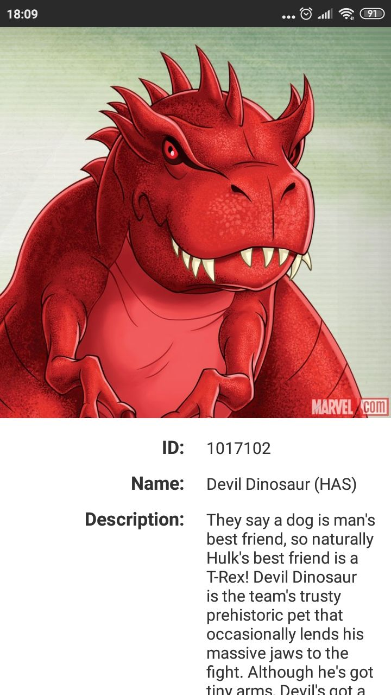

# MarvelApp

Easy app to explore Marvel characters

## Features include:
* display list of characters
* search character by id

## Preview
<p align="center">
    
    
    
    
</p>

## Video preview


## Used libraries:
* [Kotlin coroutines](https://developer.android.com/kotlin/coroutines) - a coroutine is a concurrency design pattern that you can use on Android to simplify code that executes asynchronously
* [Retrofit](https://square.github.io/retrofit/) - is a REST client for Android, that makes easy to get and load JSON (or other structured data) through a REST based web service.
* [Swiperefreshlayout](https://developer.android.com/jetpack/androidx/releases/swiperefreshlayout) - a UI component that handle gesture "Pull to Refresh".

## Getting started
1. Clone the repo
```
 $ git clone https://github.com/andrjuxa121/MarvelApp.git
 ```
2. Open project in Android studio or IntelliJ IDEA
3. Run on android device using your IDE's tools.